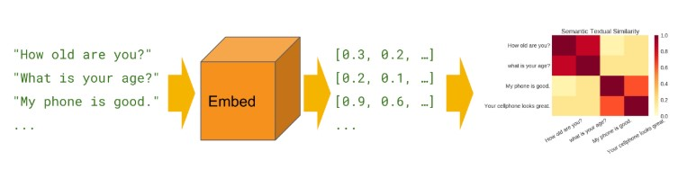
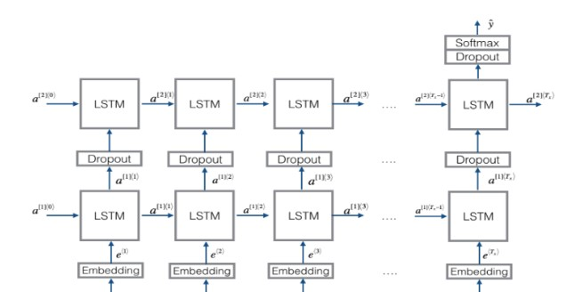
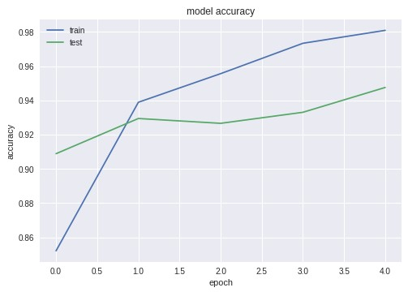
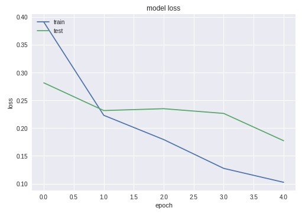

# **Application of Transfer Learning - Usage of Sentence Embeddings for Fake News Detection by Deep Learning.**

In this project, Google Universal Sentence Encoder is used. Using Google's Sentence Encoder Deep learning Models where trained and their performance was documented.<br/>
The task was to build a model that could classify news into two different classes, Real and Fake.<br/>
Labelled dataset was available.<br/>
This technique is supposed to work with any kind of **NLP classification task**.<br/>

Research paper - [Universal Sentence Encoder](https://arxiv.org/abs/1803.11175)

Sentence Encoder by Google - [Tensorflow hub](https://tfhub.dev/google/universal-sentence-encoder/2)

*Key Requirements: Python 3+, Keras 2+, TensorFlow 1+. <br/>Training was performed on [Google Colab](https://colab.research.google.com/)*

## Contents

### **Python Notebooks** 

- 3 python Notebooks demostrating Model performance on three different datasets.
- 1 Python Notebook showing how embeddings where generated.

## Fake or Real Dataset

3 different Datasets where used in this project. These are:
- [News Dataset from Kaggle](https://www.kaggle.com/c/fake-news/data) 
- [Dataset available from OpensSources](http://www.opensources.co/)
- [News obtained from George McIntire Fake News Dataset](https://bitbucket.org/WiZar-D/fake_real_dataset) <br/>

**Dataset describtion**

Dataset consisted of labelled news under two categories "Real" and "Fake".
Below is an overview of the dataset.
<table>
    <tr>
        <th colspan="3">Dataset 1: Kaggle</th>
    </tr>
    <tr>
        <th>Type</th>
        <td>Real</td>
        <td>Fake</td>
    </tr>
    <tr>
        <th>Count</th>
        <td>6200</td>
        <td>6200</td>
    </tr>
</table>
<table>
    <tr>
        <th colspan="3">Dataset 2: OpenSources</th>
    </tr>
    <tr>
        <th>Type</th>
        <td>Real</td>
        <td>Fake</td>
    </tr>
    <tr>
        <th>Count</th>
        <td>6724</td>
        <td>6162</td>
    </tr>
</table><table>
    <tr>
        <th colspan="3">Dataset 3: Work done by George McIntire</th>
    </tr>
    <tr>
        <th>Type</th>
        <td>Real</td>
        <td>Fake</td>
    </tr>
    <tr>
        <th>Count</th>
        <td>1900</td>
        <td>1992</td>
    </tr>
</table>

**The number of news articles in the respective corpus where more than the figures shown above. Only those articles in which 
number of sentences was more than 7 and less than 50.** <br/>

## **Model Description**

4 Deep Learning models where developed for classification task.
[Recurrent Neural Networks](https://keras.io/layers/recurrent/) where used.

**Reason for selecting articles which has sentences in the range(7,50)**<br/>
As LSTM takes input a 3-d Tensor comprised of (samples, timesteps, features), having this limit help us to design a network
which takes input a 3-d Tensor of shape (n,50,512), where
- "n" is number of articles.
**Google sentence encoder** returns sentence embedding which is of shape (512,).



These where then reshaped into [numpy's multidimensional, homogeneous array](https://docs.scipy.org/doc/numpy-1.15.0/reference/generated/numpy.ndarray.html)

These numpy arrays made up the input for the Neural Network.<br/>

*(The figure shown below is taken from deeplearning course on Coursera. Similar version of this network was implemented.)*<br/>



**3 different architecture where used, these are:**
- Single Layer LSTM Model - A LSTM layer is defined which is followed by a dense/ output layer.
- Double Layer LSTM (Connected) Model - 2 Layer of LSTM are defined with output from previous layer fed into next LSTM layer.
- CNN LSTM Model - First a CNN layer or layers are defined, wrapping them in a TimeDistributed layer and then LSTM and output layer is defined. <br/>

All this model where build using Keras.

## Results

Evaluation of each model is shown with the help of [confusion matrix](https://scikit-learn.org/stable/modules/generated/sklearn.metrics.confusion_matrix.html), Loss and Accuracy Graphs.<br/>
*sample output*
```
[[1178   67]
 [  63 1172]]
              precision    recall  f1-score   support

        Real       0.95      0.95      0.95      1245
        Fake       0.95      0.95      0.95      1235

   micro avg       0.95      0.95      0.95      2480
   macro avg       0.95      0.95      0.95      2480
weighted avg       0.95      0.95      0.95      2480
```
 

From the graphs it is evident that model has overfitted the data.<br/>
Work needed to be done to make generalize the model, implementing more complex and deeper network, training on more data may improve model performance.<br/>
More feautres can be added apart from sentence embeddings, like how much the headline agrees with the content, source of the article and so on..<br/>
Neural Network trained with [ELMo](https://arxiv.org/abs/1802.05365) ([*developed by AllenNLP*](https://allennlp.org/elmo)) - A Deep contextualized word representations can also be used.
